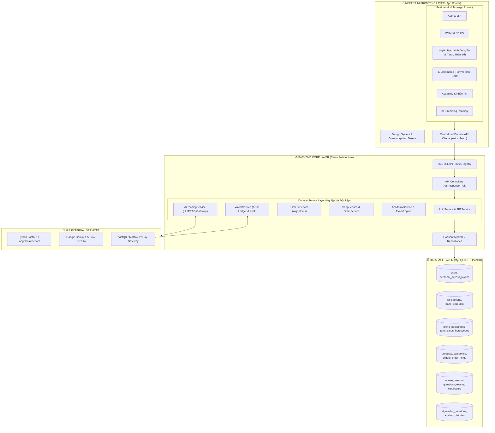

# BÁO CÁO RÀ SOÁT & QUY HOẠCH KIẾN TRÚC TỔNG THỂ
## DỰ ÁN: KHOA HỌC TÂM LINH (ESOTERIC SCIENCE ECOSYSTEM)

> **Cấp độ kiến trúc**: Senior Principal Enterprise Architecture  
> **Mô hình mục tiêu**: **Domain-Driven Modular Monolith (Sẵn sàng tách Microservices & AI Gateway)**  
> **Triết lý thiết kế**: Phân tách ranh giới rõ ràng (Separation of Concerns), dữ liệu độc lập (Data Isolation), mở rộng tính năng theo module cắm rút (Pluggable Modules).

---



---

## 🗄️ 1. RÀ SOÁT TẦNG DATABASE (DATA ARCHITECTURE)

### 📌 Nguyên tắc cốt lõi:
* **Tính toàn vẹn (ACID)**: Mọi giao dịch tài chính phải có bảng nhật ký sổ cái kép (`balance_before`, `balance_after`, `lockForUpdate`).
* **Tính cô lập (Data Isolation)**: Dữ liệu chia thành **6 Phân vùng Nghiệp vụ (Domains)** rõ ràng:

| Phân Vùng Domain | Các Bảng Chính | Đặc Điểm Kỹ Thuật & Tối Ưu |
| :--- | :--- | :--- |
| **1. Identity & Access** | `users`, `personal_access_tokens` | Khóa `uuid` độc lập, 2FA secret mã hóa, Composite index `[email, status]`. |
| **2. Finance & Ledger** | `transactions`, `bank_accounts` | Sổ cái không được phép sửa/xóa (Immutable Ledger). Pessimistic locking. |
| **3. Esoteric Knowledge** | `iching_hexagrams`, `tarot_cards`, `horoscopes` | Lưu trữ tri thức tĩnh & cấu trúc nhị phân 6-bit của 64 Quẻ, 78 Lá bài Tarot. JSON Indexing. |
| **4. E-Commerce** | `products`, `categories`, `orders`, `order_items` | Quan hệ đa hình (Polymorphic `item_type`) mua chung sản phẩm vật lý, khóa học, dịch vụ. |
| **5. Academy & Exam** | `courses`, `lessons`, `questions`, `exam_results`, `certificates` | Cấu trúc phân cấp Chương $\rightarrow$ Bài học $\rightarrow$ Ngân hàng câu hỏi trắc nghiệm $\rightarrow$ Chứng chỉ số. |
| **6. AI Memory & Context** | `ai_reading_sessions`, `ai_chat_histories` | Lưu vector embeddings, user context và lịch sử hội thoại luận giải cho RAG. |

---

## ⚙️ 2. RÀ SOÁT TẦNG BACKEND (SERVICE-ORIENTED CLEAN ARCHITECTURE)

### 📌 Phân tách ranh giới rõ ràng:
1. **Controllers (Mỏng - Thin Controllers)**:
   - Chỉ chịu trách nhiệm: Nhận request $\rightarrow$ Validate $\rightarrow$ Gọi Service $\rightarrow$ Trả JSON chuẩn qua `ApiResponse` trait.
   - **Tuyệt đối không viết logic nghiệp vụ tính toán hay query DB trực tiếp trong Controller**.

2. **Services (Dày - Rich Domain Services)**:
   - `WalletService`: Xử lý nạp, trừ, đóng băng số dư, ghi lịch sử giao dịch.
   - `EsotericService`: Chứa toàn bộ thuật toán huyền học thuần túy (Can Chi, Bát Tự, Ma trận Pythagoras 3x3, Gieo quẻ 3 đồng xu).
   - `OrderService`: Xử lý quy trình giỏ hàng, áp mã giảm giá, kiểm tra sở hữu khóa học (`checkOwnership`).
   - `AiReadingService`: Cầu nối gửi prompt, lưu ngữ cảnh phiên và gọi LLM (Gemini / Python FastApi).

3. **Cấu trúc thư mục Backend chuẩn hóa**:
```
back-end/app/
├── Http/
│   ├── Controllers/
│   │   ├── AuthController.php
│   │   ├── WalletController.php
│   │   ├── EsotericController.php
│   │   ├── ShopController.php
│   │   ├── AcademyController.php
│   │   └── AiReadingController.php
│   └── Requests/              # Form Request Validators (Input Sanitization)
├── Services/                  # Business Logic Layer
│   ├── AuthService.php
│   ├── WalletService.php
│   ├── EsotericService.php
│   ├── ShopService.php
│   ├── AcademyService.php
│   └── AiReadingService.php
├── Models/                    # Eloquent Entities & Relationships
├── Traits/                    # Reusable Traits (ApiResponse.php)
└── Enums/                     # TransactionType, OrderStatus, SpiritualLevel
```

---

## 🎨 3. RÀ SOÁT TẦNG FRONTEND (NEXT.JS 14 APP ROUTER)

### 📌 Cấu trúc Module hóa chuẩn Enterprise:
Chia nhỏ Frontend thành các **Feature Modules độc lập**, mỗi module có UI, hooks và API client riêng:

```
front-end/src/
├── app/                       # Next.js App Router (File-based Routing & Metadata)
│   ├── (marketing)/           # Route Group: Trang công khai
│   │   ├── page.js            # Trang chủ
│   │   ├── gioi-thieu/page.js # Giới thiệu
│   │   └── lien-he/page.js    # Liên hệ
│   ├── dich-vu/               # Feature: Dịch vụ Huyền Học
│   │   ├── kinh-dich/page.js  # 3D Coin Casting
│   │   ├── than-so-hoc/page.js# Pythagoras Matrix 3x3
│   │   ├── tarot/page.js      # Tarot 78 Cards
│   │   └── tu-vi/page.js      # Lá số Tử Vi
│   ├── cua-hang/              # Feature: Thương mại & Giỏ hàng
│   ├── hoc-vien/              # Feature: Học viện & Khảo thí
│   └── tai-khoan/             # Feature: Sổ cái Ví, 2FA & Profile
│
├── components/
│   ├── ui/                    # Base UI (Button, Modal, Card, SkeletonLoader, Badge)
│   ├── layout/                # Global Layout (Navbar, Footer, MegaDropdowns)
│   └── features/              # Feature-specific Components
│       ├── esoteric/          # Coin3D, TarotCard3D, MatrixGrid
│       ├── commerce/          # ProductCard, CartDrawer, CheckoutModal
│       └── academy/           # QuizTimer, CertificateView
│
├── services/                  # Domain API Clients (Tách biệt theo Module)
│   ├── api.js                 # Base Axios Instance (Interceptors, Token)
│   ├── authApi.js             # Đăng nhập, 2FA, Đăng ký
│   ├── walletApi.js           # Nạp tiền, Rút tiền, Sổ cái
│   ├── esotericApi.js         # Gieo quẻ, Tính thần số, Luận tử vi
│   ├── shopApi.js             # Sản phẩm, Đơn hàng
│   └── academyApi.js          # Khóa học, Nộp bài thi
│
└── contexts/                  # Global State (AuthContext, CartContext, AlertContext)
```

---

## 🚀 4. LỘ TRÌNH MỞ RỘNG TỪNG TÍNH NĂNG ĐỘC LẬP (EXTENSIBILITY ROADMAP)

1. **Module AI Luận Giải (AI Reading Assistant)**:
   - Chỉ cần thêm `AiReadingService.php` ở BE $\rightarrow$ Kết nối Gemini API hoặc Python FastAPI.
   - Frontend chỉ cần thêm component `AiChatBox.js` ở trang Kinh Dịch / Tử Vi để stream kết quả.
   - **Không ảnh hưởng đến DB hay các module khác**.

2. **Module Cổng Thanh Toán Tự Động (VietQR / MoMo Webhook)**:
   - Thêm route `POST /api/webhooks/payment` $\rightarrow$ `WalletService::deposit()` với Pessimistic Lock.
   - FE tự động cập nhật số dư ví Linh Tệ qua Server-Sent Events hoặc Polling.

3. **Module Mạng Xã Hội Huyền Học (Spiritual Community Feed)**:
   - Thêm 2 bảng `posts` và `comments` trong DB.
   - Tạo `CommunityController` & `CommunityService`.
   - Thêm route `/cong-dong` trên Next.js App Router.
